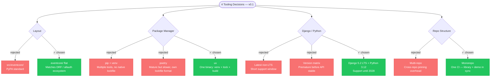
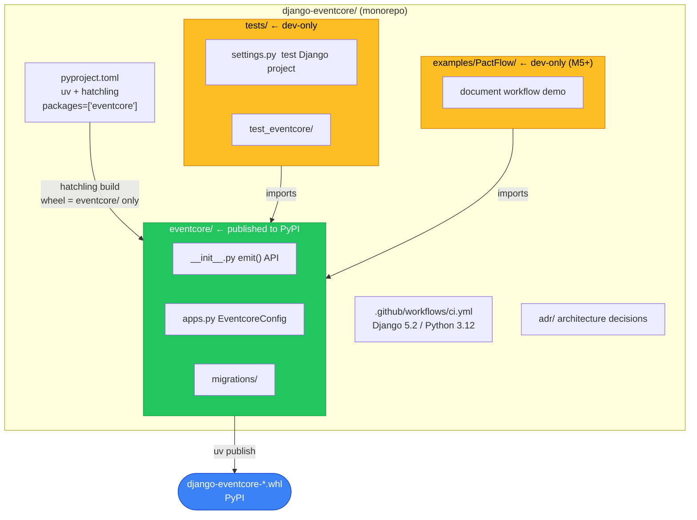

# 1. Tooling and app skeleton for v0.1

* Status: accepted
* Date: 2026-06-16

## Context and Problem Statement

`django-eventcore` is starting from an empty repository. Before any library code can be
written (M2 onward), four foundational decisions need to be made: how the repo is laid
out, what tool manages dependencies/venv/packaging, which Django/Python versions v0.1
targets, and whether the library, its test project, and its future example app live in
one repo or several. These decisions are cheap to make now and expensive to reverse
once `eventcore/` has real models, migrations, and a relay implementation — so they are
recorded here as a single M1 ADR covering the project skeleton.

## Decision Drivers

* The project's stated goal is a **senior-signaling, public, contributor-facing OSS
  repo** — conventions should match what experienced Django contributors expect, not
  surprise them.
* v0.1 is built by one part-time maintainer over approximately one month at 10–20 hrs/week —
  tooling should minimize ceremony and context-switching.
* The library must be installable as a normal Django app (`pip install django-eventcore`,
  add to `INSTALLED_APPS`) — packaging conventions matter from day one.
* `examples/PactFlow` (the demo app) and `tests/` (the test project) both depend on
  `eventcore` and need to evolve in lockstep with it during active development.

## Decision Outcome

Adopt: **flat app layout**, **uv** for dependency/venv/build management, **Django 5.2
LTS on Python 3.12** as the v0.1 target, and a **monolith-first single repo**. Each is
expanded below.

**Decision tree: four options considered, chosen paths in green**



---

### Decision 1: Flat app layout (`eventcore/`, not `src/eventcore/`)

**Considered options:**

* `src/eventcore/` — the "src layout" popularized by general Python packaging guides
  (PyPA), which prevents accidentally importing the package from the working directory
  instead of the installed wheel.
* `eventcore/` flat at repo root — the layout used by the major Django ecosystem
  packages (Django REST Framework, django-allauth, django-filter, django-celery-beat).

**Outcome:** flat layout. Rationale: this is a **Django app**, not a generic Python
library — contributors coming from DRF/allauth/django-filter will recognize the layout
immediately, and Django's own tooling (`django-admin startapp`, app config discovery,
`INSTALLED_APPS` conventions) assumes an app package at the repo root or close to it.
The src-layout's main benefit (preventing accidental local-import shadowing) matters
less here because the package is exercised through a dedicated `tests/` Django project
with its own settings module, not by running scripts from the repo root.

**Consequences:**
* (+) Familiar to Django contributors; matches the ecosystem's dominant convention.
* (+) `hatchling` packaging config (`packages = ["eventcore"]` in `pyproject.toml`) is a
  one-liner.
* (-) Slightly easier to accidentally `import eventcore` from an unintended location
  during local development — mitigated by always running through `uv run` (which uses
  the project's venv and `pythonpath = "."` is scoped to test discovery only).

---

### Decision 2: `uv` for dependency, venv, and build management

**Considered options:**

* `pip` + `venv` + `requirements.txt` (+ `pip-tools` for locking).
* `poetry` — popular, mature, but slower and with its own lockfile format and plugin
  ecosystem for build backends.
* `uv` — Astral's Rust-based package/project manager: drop-in `pip` replacement, native
  lockfile (`uv.lock`), venv management, and PEP 621 `pyproject.toml`-native project
  workflow, with first-class CI support via `astral-sh/setup-uv`.

**Outcome:** `uv`. Rationale: single tool for venv creation, dependency resolution,
locking, running commands (`uv run`), and building the wheel via `hatchling` — replacing
several tools (`pip`, `venv`, `pip-tools`, `twine` invocation glue) with one fast binary.
This matters for a part-time solo maintainer with limited session time: less tooling
friction per session. `uv` is also rapidly becoming a default recommendation in the Python packaging
ecosystem and has a maintained official GitHub Action, keeping local dev and CI in sync.

**Consequences:**
* (+) One command (`uv sync`) reproduces the exact locked environment from `uv.lock`.
* (+) Fast — negligible CI overhead for installing dependencies.
* (+) `astral-sh/setup-uv` keeps CI's `uv` version pinned and on `PATH` without manual
  installation steps.
* (-) Contributors unfamiliar with `uv` have one more tool to learn, though the surface
  area (`uv sync`, `uv run <cmd>`) is small and documented in the README quickstart.
* (-) `uv` is younger than `pip`/`poetry`; the lockfile format is `uv`-specific (not
  interchangeable with `poetry.lock` or `requirements.txt`), which is a minor lock-in
  but acceptable given the tool's trajectory and official Action support.

---

### Decision 3: Django 5.2 LTS + Python 3.12 as the v0.1 target

**Considered options:**

* Track the latest Django feature release (5.1 / 5.2 non-LTS cadence) and latest Python
  (3.13).
* Target Django 5.2 LTS (supported with security/bugfixes into 2028) on Python 3.12
  (the most recent Python with broad library/runtime support at the time of writing).
* Support a matrix of Django/Python versions from the start.

**Outcome:** Django 5.2 LTS on Python 3.12, single version (no matrix) for v0.1.
`pyproject.toml` pins `Django>=5.0,<6.0` and `requires-python = ">=3.12"`; CI runs this
single combination. Rationale: an LTS release gives the longest support window for a
library that consuming projects will pin against, and a single version keeps v0.1 CI
fast and simple while the library's API is still in flux. A version matrix (older
Django LTS + newer Django, multiple Python versions) is valuable once the public API is
stable enough that compatibility regressions are worth catching — that is explicitly
**M9 scope**, not M1.

**Consequences:**
* (+) Simple, fast CI; one thing to keep green while the API churns.
* (+) LTS gives downstream adopters confidence in a stable target.
* (-) Compatibility with older Django (4.2 LTS, still widely deployed) or Python 3.11 is
  unverified until the M9 matrix lands — acceptable risk for pre-0.1.

---

### Decision 4: Monolith-first single repo

**Considered options:**

* Separate repos: `django-eventcore` (library), `pactflow-demo` (example app), and
  possibly a separate docs/ADR repo.
* Single repo containing the `eventcore` library app, the `tests/` Django project used
  to exercise it, and (from M5 onward) `examples/PactFlow/` as a demo Django project,
  all versioned together.

**Outcome:** monolith-first single repo. Rationale: during v0.1 development the library
API and the demo app evolve together — `PactFlow` exists specifically to prove the
library's developer experience end-to-end as a document-workflow reference app, so changes to `eventcore`
and changes to its example usage are almost always part of the same commit/PR. A single
repo means one CI pipeline, one issue tracker, one version of truth for "does this
change work end-to-end," with no cross-repo version-pinning overhead. If `PactFlow`
or the docs ever need independent release cadences, they can be split out later —
splitting a monorepo is far easier than re-merging history from separate repos.

**Consequences:**
* (+) Single CI run validates library + example together; no cross-repo dependency
  pinning during active development.
* (+) Lower overhead for a solo maintainer — one clone, one set of branch/PR conventions.
* (-) The published `django-eventcore` PyPI package must be built from a subdirectory
  of a repo that also contains non-library code (`tests/`, future `examples/`) —
  mitigated by `hatchling`'s `packages = ["eventcore"]` setting, which already scopes
  the wheel to just the library package.
* (-) If `PactFlow` grows into a substantial reference app, repo size and CI time could
  grow; revisit if that becomes a problem (not expected before v0.2).

---

## Implementation Plan

**Repo structure at the end of M1** (the target an agent should produce):

```
django-eventcore/
├── eventcore/
│   ├── __init__.py
│   ├── apps.py          # EventcoreConfig
│   └── migrations/
│       └── __init__.py
├── tests/
│   ├── settings.py      # minimal Django settings for the test project
│   └── test_eventcore/
│       └── __init__.py
├── examples/            # empty at M1; PactFlow lands in M5+
├── adr/
│   └── 0001-tooling-and-app-skeleton.md
├── pyproject.toml       # uv + hatchling, see fields below
├── uv.lock
├── README.md
└── .github/
    └── workflows/
        └── ci.yml
```

**`pyproject.toml` required fields** (agent must not deviate):

```toml
[build-system]
requires = ["hatchling"]
build-backend = "hatchling.build"

[tool.hatch.build.targets.wheel]
packages = ["eventcore"]          # only the library goes in the wheel

[project]
name = "django-eventcore"
requires-python = ">=3.12"
dependencies = ["Django>=5.0,<6.0"]

[tool.uv]
dev-dependencies = ["pytest", "pytest-django"]
```

**Key commands** (all invoked via `uv run`, never bare `python`):

| Task | Command |
|------|---------|
| Install / sync deps | `uv sync` |
| Run tests | `uv run pytest` |
| Start Django shell | `uv run python manage.py shell --settings=tests.settings` |
| Build wheel | `uv build` |
| Check Django | `uv run python manage.py check --settings=tests.settings` |

**Affected paths:** `eventcore/`, `tests/`, `pyproject.toml`, `uv.lock`, `.github/workflows/ci.yml`, `adr/`

**Pattern:** every command runs through `uv run`. Never call `python` or `pip` directly.

**Repo architecture — component relationships:**



---

## Verification

- [ ] `uv sync` completes from a fresh clone with no errors
- [ ] `uv run python manage.py check --settings=tests.settings` exits 0
- [ ] `uv run python manage.py migrate --settings=tests.settings` applies all migrations without error
- [ ] `uv run pytest` runs and exits 0 (even if there are zero tests yet — at least the suite is importable)
- [ ] `uv build` produces a `.whl` file; `unzip -l *.whl` shows only `eventcore/` paths (no `tests/`, no `examples/`)
- [ ] GitHub Actions CI run is green on push to `main` / PR branch (Django 5.2, Python 3.12)
- [ ] Django admin reachable at `/admin/` when `uv run python manage.py runserver --settings=tests.settings` is started
